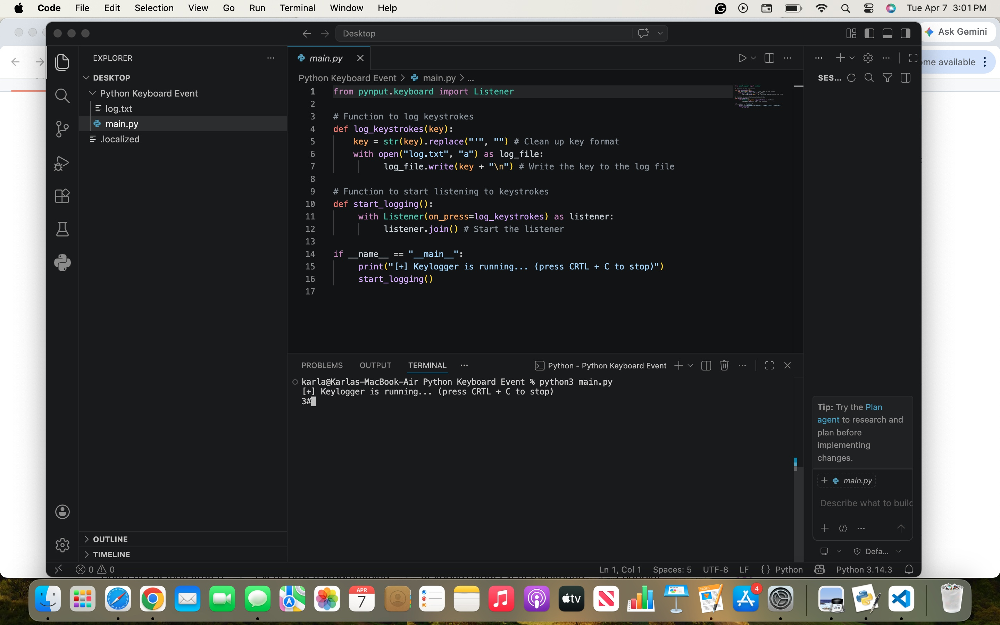

# python-keyboard-event-monitoring
Project Overview
## Demo

This project is a Python proof-of-concept created for educational cybersecurity research.
It explores how keyboard input events can be captured using Python and how operating systems implement security controls such as macOS Input Monitoring permissions.

Technologies Used
    •    Python
    •    pynput library
    •    macOS
    •    Visual Studio Code

Concepts Demonstrated
    •    Event-driven programming
    •    Keyboard input event monitoring
    •    Endpoint security controls
    •    Log file generation

Educational Purpose

This project was developed in a controlled lab environment to understand how keystroke monitoring tools work and how modern operating systems restrict unauthorized input monitoring.
